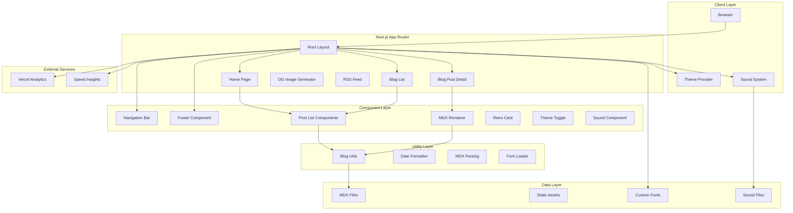
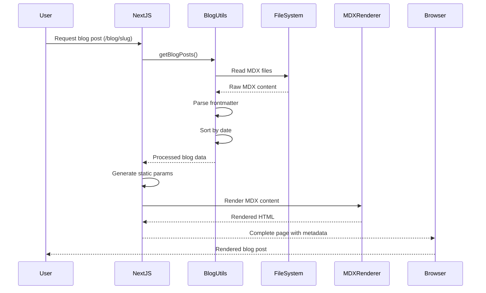
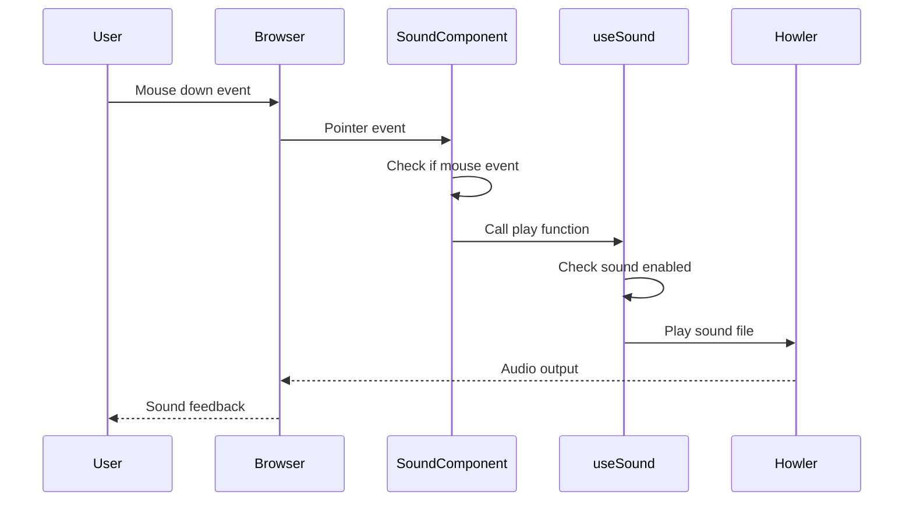
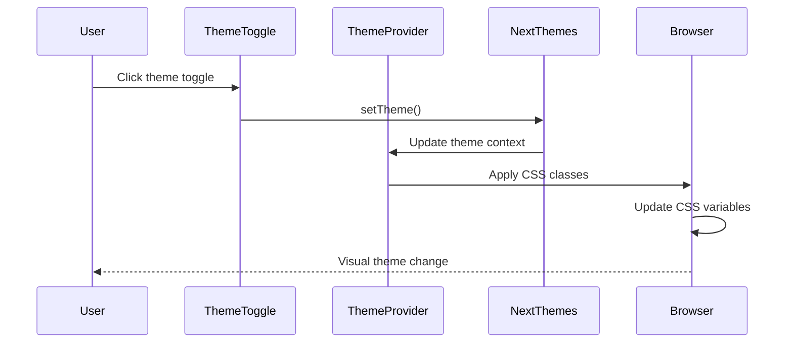
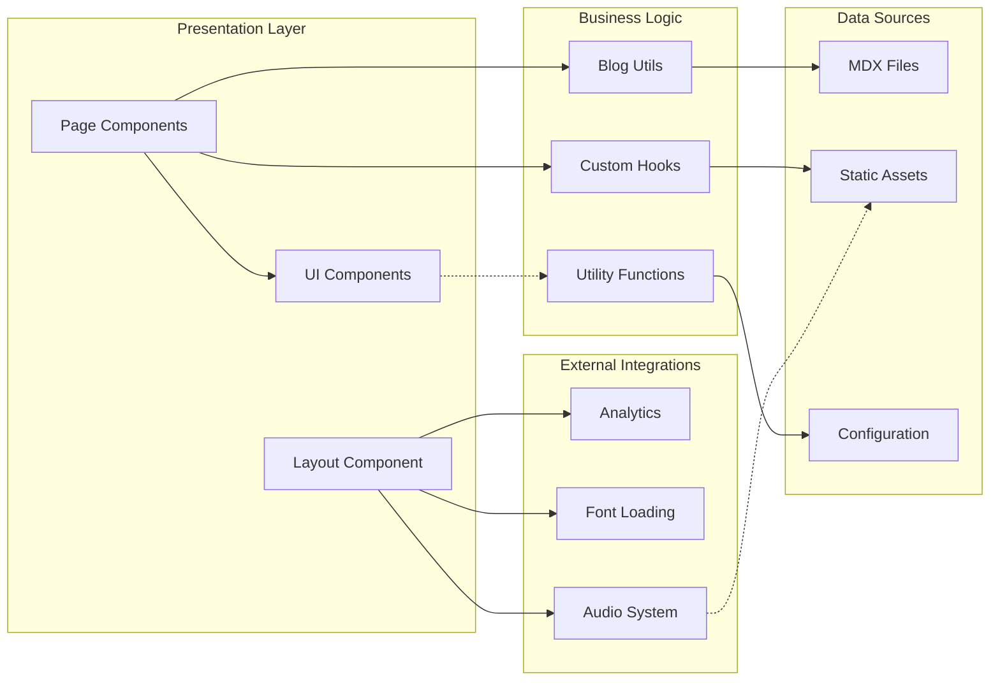

# Repository Analysis: Trevor's World - Portfolio Blog

## 1. Repository Overview

### Project Summary
Trevor's World is a modern portfolio blog built with Next.js 15, featuring a retro-aesthetic design with CRT-style visual effects, interactive sound elements, and a comprehensive MDX-based blogging system. The application serves as a personal portfolio showcasing the developer's work, thoughts, and technical expertise.

### Core Technologies
- **Framework**: Next.js 15.4.6 with App Router
- **Runtime**: React 19.1.1 
- **Language**: TypeScript 5.9.2
- **Styling**: Tailwind CSS v4 with custom Rosé Pine color palette
- **Content**: MDX with next-mdx-remote for blog posts
- **Build System**: Turbopack for development, Biome for linting/formatting
- **Package Manager**: pnpm 10.14.0 (locked)

### Key Dependencies
- **UI/UX**: Framer Motion, Lucide React, Radix UI components
- **Audio**: Howler.js for sound effects
- **Theming**: next-themes for dark/light mode
- **Analytics**: Vercel Analytics & Speed Insights
- **Fonts**: Custom local fonts (NBArchitekt, Mondwest, NeueKit)
- **Development**: Biome, TypeScript, Tailwind CSS

### Target Domain & Users
- **Domain**: Personal portfolio and technical blog
- **Target Users**: Potential employers, clients, fellow developers, and tech enthusiasts
- **Purpose**: Professional showcase, knowledge sharing, and personal branding

## 2. Project Structure Analysis

### Directory Organization
The project follows Next.js 15 App Router conventions with a clean separation of concerns:

```
/
├── app/                    # Next.js App Router directory
│   ├── blog/              # Blog functionality
│   │   ├── posts/         # MDX blog posts
│   │   ├── [slug]/        # Dynamic blog post pages
│   │   └── utils.ts       # Blog utilities
│   ├── components/        # App-specific components
│   ├── hooks/             # Custom React hooks
│   ├── og/                # Dynamic OG image generation
│   ├── rss/               # RSS feed generation
│   └── layout.tsx         # Root layout
├── components/ui/         # Reusable UI components (shadcn/ui)
├── lib/                   # Utility functions
├── public/                # Static assets (fonts, sounds, images)
└── Configuration files
```

### Configuration Files
- `next.config.ts` - Next.js configuration with Turbopack, image optimization, and experimental features
- `biome.json` - Comprehensive linting, formatting, and import organization rules
- `tsconfig.json` - TypeScript configuration with strict null checks
- `package.json` - Dependency management with pnpm overrides
- `tailwind.config.js` - Tailwind CSS configuration (implicit via global.css)

### Entry Points
- `app/layout.tsx` - Root layout with font loading, theming, and global components
- `app/page.tsx` - Home page entry point
- `app/blog/page.tsx` - Blog listing page
- `app/blog/[slug]/page.tsx` - Individual blog post pages

## 3. High-Level Architecture Diagram



## 4. Module/Component Analysis

### Core Application Modules

#### `/app/layout.tsx`
- **Responsibility**: Root layout configuration, font loading, theme provider setup
- **Dependencies**: Custom fonts, theme provider, analytics components
- **Key Features**: Font preloading, theme management, CRT visual effects, sound integration

#### `/app/page.tsx`
- **Responsibility**: Home page presentation with developer introduction and latest blog posts
- **Dependencies**: Post components, image optimization, link components
- **Key Features**: Technology showcase, personal introduction, blog post preview

### Blog System Module

#### `/app/blog/utils.ts`
- **Responsibility**: Core blog functionality - MDX parsing, file system operations, data transformation
- **Public APIs**: 
  - `getBlogPosts()` - Cached blog post retrieval
  - `formatDate()` - Date formatting with relative time
  - `Metadata` type definition
- **Dependencies**: Node.js fs module, React cache
- **Design Patterns**: Singleton pattern with React cache, functional programming approach

#### `/app/blog/page.tsx` & `/app/blog/[slug]/page.tsx`
- **Responsibility**: Blog listing and individual post rendering
- **Dependencies**: Blog utils, MDX renderer, metadata generation
- **Key Features**: Static generation, SEO optimization, JSON-LD structured data

### Component System

#### `/app/components/posts.tsx`
- **Responsibility**: Blog post listing and presentation components
- **Public APIs**: `LatestThreeBlogPosts`, `ListAllBlogPosts`, `BlogPost`
- **Dependencies**: Blog utils, Lucide icons, Next.js Link
- **Design Patterns**: Composition pattern, responsive design

#### `/app/components/click.tsx`
- **Responsibility**: Interactive sound effects for mouse interactions
- **Dependencies**: Custom useSound hook, react-use library
- **Key Features**: Motion preference detection, sound management

#### `/app/hooks/useSound.tsx`
- **Responsibility**: Audio management with Howler.js integration
- **Public APIs**: Play function, sound control methods, duration tracking
- **Dependencies**: Howler.js, React hooks
- **Design Patterns**: Custom hook pattern, lazy loading

### UI Component Library

#### `/components/ui/button.tsx`
- **Responsibility**: Reusable button component following shadcn/ui patterns
- **Dependencies**: Radix UI, class-variance-authority, Tailwind
- **Design Patterns**: Variant-based styling, forwarded refs

## 5. Class/Interface Hierarchy

```mermaid
classDiagram
    class Metadata {
        +string title
        +string publishedAt
        +string summary
        +string? image
        +string? subtitle
    }

    class BlogPost {
        +Metadata metadata
        +string slug
        +string content
    }

    class HookOptions~T~ {
        +string? id
        +number? volume
        +number? playbackRate
        +boolean? interrupt
        +boolean? soundEnabled
        +SpriteMap? sprite
        +Function? onload
    }

    class PlayOptions {
        +string? id
        +boolean? forceSoundEnabled
        +number? playbackRate
    }

    class ExposedData {
        +Howl? sound
        +Function stop
        +Function pause
        +number? duration
    }

    class ReturnedValue {
        +PlayFunction[0]
        +ExposedData[1]
    }

    class SpriteMap {
        +Record~string, [number, number]~
    }

    Metadata ||--o{ BlogPost : contains
    HookOptions ||--|| SpriteMap : uses
    ReturnedValue ||--|| ExposedData : contains
    ReturnedValue ||--|| PlayOptions : accepts
```

## 6. Data Flow and Sequence Diagrams

### Blog Post Rendering Flow


### Sound System Interaction Flow


### Theme System Flow


## 7. Module Interaction Map



## 8. Database/Storage Schema

The application uses a file-based content management system rather than a traditional database:

### MDX File Structure
```typescript
// Frontmatter Schema
interface BlogPostFrontmatter {
  title: string;           // Post title
  publishedAt: string;     // ISO date string
  summary: string;         // Post summary/description
  image?: string;          // Optional OG image path
  subtitle?: string;       // Optional subtitle
}

// File System Schema
/app/blog/posts/
  ├── post-slug.mdx       // Individual blog posts
  │   ├── frontmatter     // YAML metadata block
  │   └── content         // Markdown/MDX content
```

### Static Asset Organization
```
/public/
  ├── fonts/              // Custom typography assets
  │   ├── NBArchitektStd/ // Primary font family
  │   └── Mondwest/       // Display font family
  ├── sounds/             // Audio feedback files
  │   ├── mouse_down.mp3
  │   └── mouse_up.mp3
  └── *.png              // Technology logos and UI assets
```

### Caching Strategy
- **Blog Posts**: React.cache() for server-side caching
- **Static Assets**: Next.js automatic static optimization
- **Fonts**: Preloaded and cached via font-display strategies

## 9. API Documentation

### Internal APIs

#### Blog Utils API
```typescript
// Get all blog posts, cached and sorted by date
function getBlogPosts(): BlogPost[]

// Format date with optional relative time
function formatDate(date: string, includeRelative?: boolean): string

// Parse MDX frontmatter and content
function parseFrontmatter(fileContent: string): { metadata: Metadata, content: string }
```

#### Sound Hook API
```typescript
// Custom sound management hook
function useSound<T>(
  src: string | string[],
  options?: HookOptions<T>
): [PlayFunction, ExposedData]

// Click sound management
function useClick(path: string): ReturnedValue | [() => void, null]
```

### Route-Based APIs

#### Static Routes
- `GET /` - Home page with latest blog posts
- `GET /blog` - Blog listing page with all posts
- `GET /blog/[slug]` - Individual blog post pages
- `GET /rss` - XML RSS feed
- `GET /og` - Dynamic Open Graph image generation
- `GET /sitemap.xml` - Search engine sitemap
- `GET /robots.txt` - Search engine robots file

#### Dynamic Generation
- **Blog Posts**: Static generation at build time via `generateStaticParams()`
- **OG Images**: Dynamic generation with query parameters
- **RSS Feed**: Generated from blog post metadata

## 10. Key Algorithms and Business Logic

### Blog Post Processing Algorithm
```typescript
// Multi-step blog processing pipeline
1. File System Scan → Find all .mdx files
2. Content Reading → Read raw file content
3. Frontmatter Parsing → Extract YAML metadata using regex
4. Content Separation → Split metadata from markdown content
5. Data Transformation → Convert to structured BlogPost objects
6. Sorting → Order by publishedAt date (newest first)
7. Caching → Store results in React cache for performance
```

### Date Formatting Logic
```typescript
// Intelligent date formatting with relative time
1. Parse input date string
2. Calculate time difference from current date
3. Apply hierarchical formatting:
   - Years ago: "Xy ago"
   - Months ago: "Xmo ago"  
   - Days ago: "Xd ago"
   - Same day: "Today"
4. Provide full date as fallback
```

### Sound System Logic
```typescript
// Progressive enhancement for audio
1. Check for reduced motion preference
2. Lazy load Howler.js on first interaction
3. Enable sound system after user gesture
4. Manage multiple audio instances
5. Provide graceful degradation for accessibility
```

### Theme System Logic
```typescript
// Automatic theme detection and management
1. Detect system theme preference
2. Load saved user preference
3. Apply CSS custom properties
4. Handle theme transitions
5. Persist theme choice across sessions
```

## 11. Testing Strategy

### Current Testing Approach
The project currently lacks a formal testing framework, indicating an opportunity for improvement. Based on the codebase structure, a recommended testing strategy would include:

#### Recommended Test Structure
```
/__tests__/
  ├── components/     # Component unit tests
  ├── utils/          # Utility function tests
  ├── hooks/          # Custom hook tests
  └── integration/    # Integration tests
```

#### Test Coverage Areas
- **Blog Utils**: File parsing, date formatting, content processing
- **Sound System**: Hook behavior, audio management, accessibility
- **Theme System**: Theme switching, persistence, system integration
- **Components**: Rendering, user interactions, responsive behavior

#### Testing Tools Recommendations
- **Unit Testing**: Jest with React Testing Library
- **Component Testing**: Storybook for component development
- **E2E Testing**: Playwright for user journey testing
- **Visual Testing**: Chromatic for visual regression testing

## 12. Security Considerations

### Current Security Measures

#### Input Sanitization
- **MDX Content**: Processed through next-mdx-remote with safe defaults
- **User Input**: Limited to theme preferences and navigation
- **File System**: Restricted to designated blog posts directory

#### Content Security
- **Static Generation**: Pre-rendered content reduces attack surface
- **No Database**: File-based approach eliminates SQL injection risks
- **Sanitized HTML**: MDX processing includes XSS protection

#### External Dependencies
- **Analytics**: Vercel Analytics with privacy-focused approach
- **Font Loading**: Local font files reduce third-party dependencies
- **Audio Files**: Self-hosted sound assets

### Security Recommendations
1. **Content Validation**: Implement frontmatter schema validation
2. **CSP Headers**: Add Content Security Policy headers in next.config.ts
3. **Dependency Scanning**: Regular dependency updates via Dependabot
4. **Rate Limiting**: Consider rate limiting for dynamic routes (OG images)

## 13. Performance and Scalability

### Current Optimizations

#### Build-Time Optimizations
- **Static Generation**: All blog content pre-rendered at build time
- **Image Optimization**: Next.js automatic image optimization with modern formats
- **Font Optimization**: Local font hosting with optimal loading strategies
- **Code Splitting**: Automatic code splitting via Next.js App Router

#### Runtime Optimizations
- **React Cache**: Blog post data cached to prevent repeated file system access
- **Lazy Loading**: Howler.js dynamically imported on first use
- **Reduced Motion**: Respects user accessibility preferences
- **Package Optimization**: Experimental optimizePackageImports for tree shaking

#### Performance Monitoring
- **Vercel Analytics**: User behavior and performance tracking
- **Speed Insights**: Core Web Vitals monitoring
- **Bundle Analysis**: Package import optimization for key libraries

### Scalability Considerations
- **Content Growth**: File-based system suitable for personal blog scale
- **Asset Management**: Consider CDN for larger asset libraries
- **Build Time**: MDX processing scales linearly with content volume
- **Caching Strategy**: React cache sufficient for current scale

## 14. Development Workflow

### Build and Deployment Process
```bash
# Development workflow
pnpm dev          # Start development server with Turbopack
pnpm build        # Production build with static generation
pnpm start        # Production server start

# Code quality workflow  
npx biome check           # Lint and format check
npx biome check --write   # Auto-fix issues
```

### Development Environment Setup
1. **Node.js**: Compatible with Next.js 15 requirements
2. **Package Manager**: pnpm 10.14.0 (locked via packageManager field)
3. **Code Editor**: VSCode recommended with Biome extension
4. **Font Assets**: Local font files included in repository

### Code Style and Conventions
- **Formatter**: Biome with 2-space indentation, 120 character line width
- **Import Organization**: Automatic import sorting via Biome
- **TypeScript**: Strict null checks enabled, no explicit any types allowed
- **Component Naming**: PascalCase for React components, camelCase for utilities

### Git Workflow
- **Main Branch**: `main` branch for production deployments
- **Commit Style**: Conventional commits preferred based on recent history
- **Static Analysis**: Biome checks can be integrated into pre-commit hooks

## 15. Technical Debt and Improvement Areas

### Current Technical Debt

#### Testing Infrastructure
- **Missing Test Suite**: No testing framework currently implemented
- **Component Testing**: React components lack unit tests
- **Utility Testing**: Blog utils and custom hooks untested
- **Integration Testing**: End-to-end user flows not validated

#### Type Safety Improvements
- **Loose TypeScript Config**: `strict: false` in tsconfig.json
- **Missing Type Definitions**: Some areas could benefit from stricter typing
- **Error Boundaries**: No React error boundaries for graceful error handling

#### Performance Opportunities
- **Bundle Analysis**: Could benefit from detailed bundle analysis
- **Image Optimization**: Custom cursor images could be optimized
- **Service Worker**: No offline functionality or service worker implementation

### Recommended Improvements

#### Short-term (1-2 sprints)
1. **Enable TypeScript Strict Mode**: Update tsconfig.json for better type safety
2. **Add Basic Testing**: Implement Jest + React Testing Library
3. **Error Boundaries**: Add React error boundaries for blog rendering
4. **Bundle Analysis**: Add webpack-bundle-analyzer for optimization insights

#### Medium-term (3-6 months)
1. **Comprehensive Test Suite**: Achieve 80%+ code coverage
2. **Performance Monitoring**: Implement detailed Core Web Vitals tracking
3. **Content Management**: Consider headless CMS for easier content editing
4. **Progressive Web App**: Add PWA features for offline reading

#### Long-term (6+ months)
1. **Microinteractions**: Enhance user experience with subtle animations
2. **Search Functionality**: Add blog post search and filtering
3. **Comment System**: Consider adding blog comments (possibly static)
4. **Multi-language Support**: Internationalization for broader reach

### Architecture Evolution
- **Monorepo Structure**: Could evolve into monorepo if complexity increases
- **Serverless Functions**: API routes for dynamic features (search, analytics)
- **Database Integration**: Consider database for user analytics or comments
- **Headless CMS**: Migration to headless CMS for non-technical content editing

---

## Conclusion

Trevor's World represents a well-architected modern web application built with contemporary technologies and best practices. The codebase demonstrates strong technical decision-making with its use of Next.js 15, TypeScript, and a thoughtful component architecture. The unique retro aesthetic combined with modern web technologies creates a distinctive user experience.

The project excels in areas such as performance optimization, static generation, and developer experience. However, there are opportunities for improvement in testing infrastructure, type safety, and long-term maintainability. The recommended improvements provide a clear roadmap for evolution while maintaining the project's core strengths and unique character.

The file-based content management approach is appropriate for the current scale while remaining flexible for future growth. The emphasis on accessibility, performance, and user experience aligns well with modern web development principles.