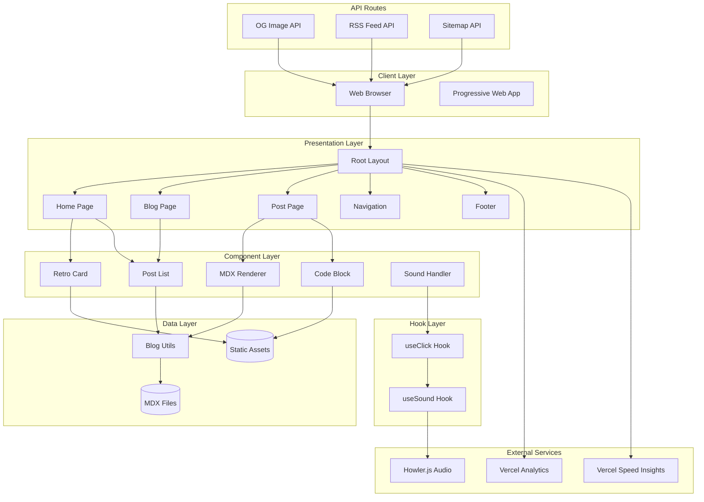
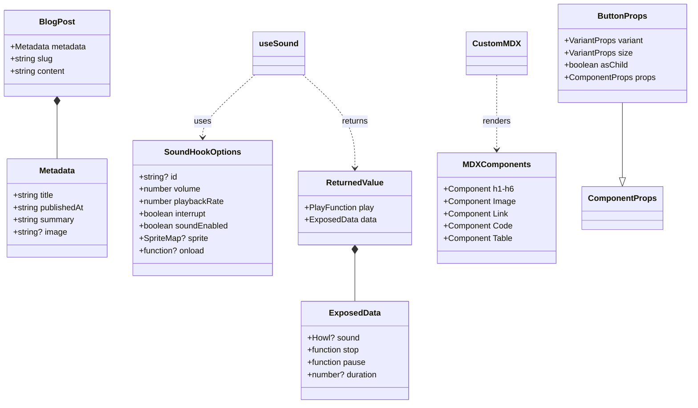
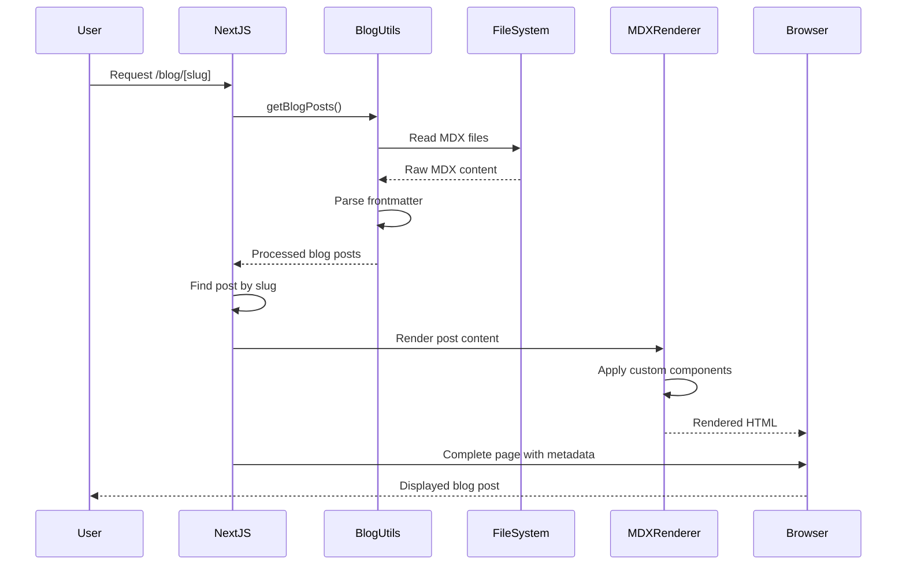
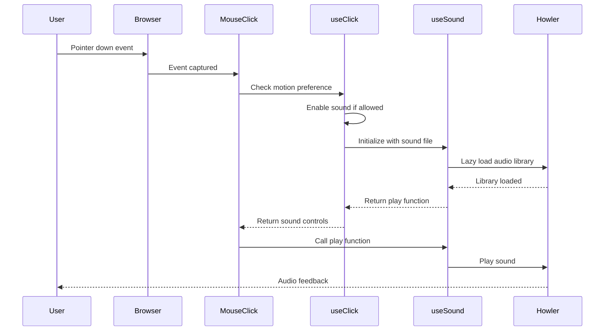
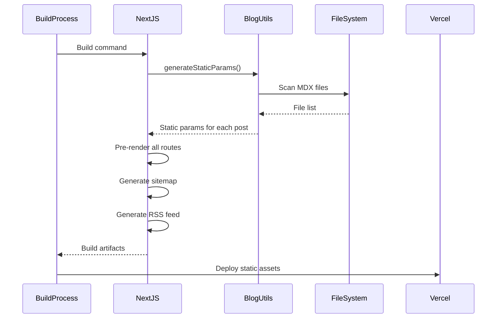
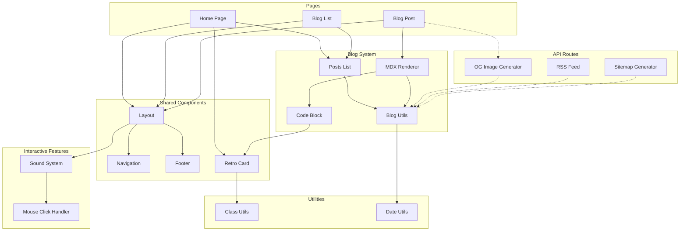
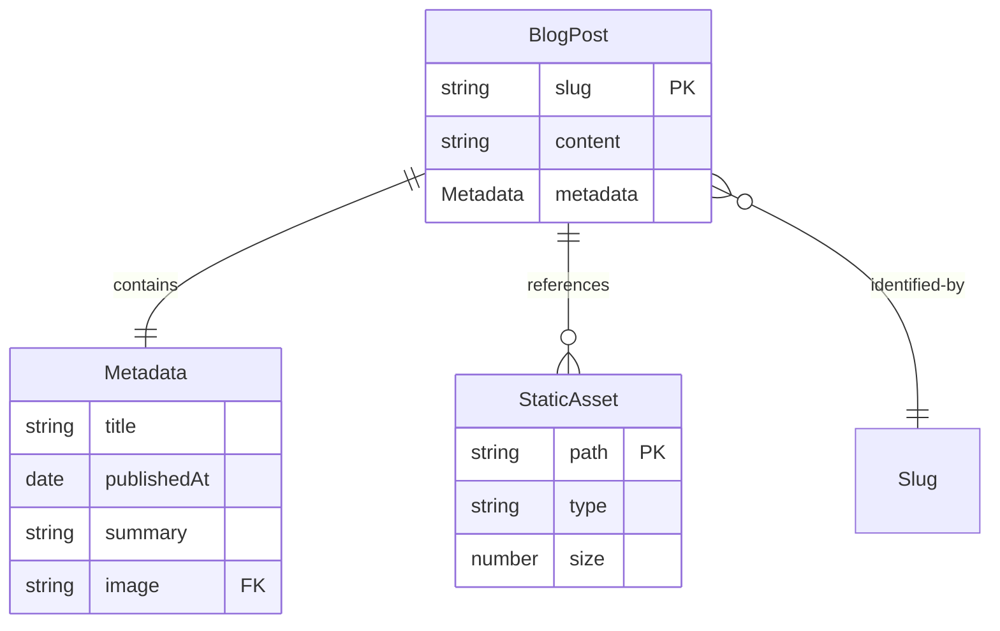

# Repository Analysis: Trevor's World Portfolio Blog

## 1. Repository Overview

**Project Purpose**: A personal portfolio and blog website showcasing Trevor's software development work, projects, and technical writing.

**Primary Technologies**:
- **Frontend Framework**: Next.js 15 with App Router
- **UI Framework**: React 19
- **Styling**: Tailwind CSS v4 with custom Rosé Pine color palette
- **Content Management**: MDX for blog posts with frontmatter
- **Typography**: Custom local fonts (NBArchitekt, Mondwest, NeueKit)
- **Audio**: Howler.js for interactive sound effects
- **Component Library**: Shadcn/ui components with Radix UI primitives

**Key Dependencies**:
- `next` (15.4.6) - React framework
- `react` (19.1.1) - UI library
- `tailwindcss` (4.1.11) - CSS framework
- `@biomejs/biome` (2.1.4) - Linting and formatting
- `howler` (2.2.4) - Audio library
- `next-mdx-remote` (5.0.0) - MDX processing
- `framer-motion` (12.23.12) - Animation library
- `@vercel/analytics` & `@vercel/speed-insights` - Performance monitoring

**Target Users**: Potential employers, clients, and fellow developers interested in Trevor's work and technical blog content.

**Domain**: Personal portfolio with integrated technical blog featuring retro/CRT aesthetic design.

## 2. Project Structure Analysis

```
trevors_world/
├── app/                          # Next.js App Router pages
│   ├── blog/                     # Blog functionality
│   │   ├── posts/               # MDX blog post files
│   │   ├── [slug]/              # Dynamic blog post pages
│   │   ├── page.tsx             # Blog listing page
│   │   └── utils.ts             # Blog utility functions
│   ├── components/              # Shared React components
│   │   ├── nav.tsx              # Navigation component
│   │   ├── footer.tsx           # Footer component
│   │   ├── posts.tsx            # Blog post components
│   │   ├── click.tsx            # Sound interaction handler
│   │   ├── retroCard.tsx        # Retro-styled card component
│   │   ├── code-block.tsx       # Code syntax highlighting
│   │   └── mdx.tsx              # MDX component overrides
│   ├── hooks/                   # Custom React hooks
│   │   └── useSound.tsx         # Audio management hook
│   ├── layout.tsx               # Root layout with fonts/analytics
│   ├── page.tsx                 # Homepage
│   ├── global.css               # Global styles and CSS variables
│   ├── og/route.tsx             # Dynamic OG image generation
│   ├── rss/route.ts             # RSS feed generation
│   ├── sitemap.ts               # Sitemap generation
│   └── robots.ts                # SEO robots.txt
├── components/ui/               # Shadcn/ui components
│   └── button.tsx               # Button component variants
├── lib/                         # Utility libraries
│   └── utils.ts                 # Class name utilities
├── public/                      # Static assets
│   ├── fonts/                   # Custom font files
│   ├── sounds/                  # Audio files
│   └── *.png, *.svg            # Images and icons
├── biome.json                   # Biome configuration
├── next.config.ts               # Next.js configuration
├── tsconfig.json                # TypeScript configuration
├── components.json              # Shadcn/ui configuration
├── postcss.config.js            # PostCSS configuration
└── package.json                 # Dependencies and scripts
```

**Configuration Files**:
- `biome.json`: Code linting, formatting, and import organization rules
- `next.config.ts`: Next.js optimization settings and experimental features
- `components.json`: Shadcn/ui component library configuration
- `tsconfig.json`: TypeScript compiler options with strict mode
- `postcss.config.js`: PostCSS processing for Tailwind CSS

**Entry Points**:
- `app/layout.tsx`: Root layout with global styles and providers
- `app/page.tsx`: Homepage with portfolio content
- `app/blog/page.tsx`: Blog listing page
- `app/blog/[slug]/page.tsx`: Individual blog post pages

## 3. High-Level Architecture Diagram



## 4. Module/Component Analysis

### Core Components

**Layout (`app/layout.tsx`)**
- **Responsibility**: Root application layout, font loading, analytics integration
- **Dependencies**: Local fonts, Vercel analytics, global CSS
- **Key Features**: Custom font variables, CRT aesthetic overlays, responsive design

**Navigation (`app/components/nav.tsx`)**
- **Responsibility**: Site navigation with retro styling
- **API**: Simple nav items object with paths and labels
- **Dependencies**: Next.js Link, Tailwind classes

**Blog System (`app/blog/utils.ts`)**
- **Responsibility**: MDX file processing, frontmatter parsing, post management
- **Public Interface**:
  - `getBlogPosts()`: Returns sorted blog posts
  - `formatDate()`: Date formatting utility
- **Dependencies**: Node.js fs module, React cache
- **Patterns**: Factory pattern for post creation, caching for performance

**MDX Renderer (`app/components/mdx.tsx`)**
- **Responsibility**: Custom MDX component overrides and rendering
- **Public Interface**: `CustomMDX` component with props
- **Dependencies**: next-mdx-remote, custom components
- **Features**: Custom link handling, image optimization, code block styling

**Sound System (`app/hooks/useSound.tsx`)**
- **Responsibility**: Audio management with accessibility considerations
- **Public Interface**: `useSound(src, options)` hook
- **Dependencies**: Howler.js (lazy loaded)
- **Features**: Prefers-reduced-motion support, dynamic loading

**RetroCard (`app/components/retroCard.tsx`)**
- **Responsibility**: Styled container with retro 3D border effect
- **API**: `children` and optional `className` props
- **Dependencies**: Utility class merger
- **Pattern**: Compound component with visual decoration

### Utility Modules

**Class Utilities (`lib/utils.ts`)**
- **Responsibility**: Tailwind class name merging and conflict resolution
- **Dependencies**: clsx, tailwind-merge
- **Pattern**: Higher-order utility function

**Button Component (`components/ui/button.tsx`)**
- **Responsibility**: Reusable button component with multiple variants
- **Dependencies**: Radix UI Slot, class-variance-authority
- **Variants**: default, destructive, outline, secondary, ghost, link, aquaBlue, aquaGrey
- **Pattern**: Variant-driven design with compound composition

## 5. Class/Interface Hierarchy



## 6. Data Flow and Sequence Diagrams

### Blog Post Rendering Flow



### Sound Interaction Flow



### Static Generation Flow



## 7. Module Interaction Map



## 8. Database/Storage Schema

This application uses a **file-based content management system** with MDX files:

### Content Schema

```typescript
// Blog Post Frontmatter Schema
interface BlogPostMetadata {
  title: string;           // Post title
  publishedAt: string;     // ISO date string
  summary: string;         // Brief description
  image?: string;          // Optional cover image path
}

// File Structure Schema
interface BlogPost {
  metadata: BlogPostMetadata;
  slug: string;           // Derived from filename
  content: string;        // Raw MDX content
}
```

### Storage Patterns

1. **Static File Storage**: MDX files in `app/blog/posts/`
2. **Asset Storage**: Images, fonts, and sounds in `public/`
3. **Build-time Processing**: Files processed during Next.js build
4. **Caching**: React cache for blog post data
5. **No Database**: All content stored as files in repository

### Data Relationships



## 9. API Documentation

### Internal API Routes

#### OG Image Generation (`/og`)
- **Method**: GET
- **Parameters**: `title` (query string)
- **Response**: Dynamic PNG image (1200x630)
- **Usage**: Social media previews
- **Example**: `/og?title=My%20Blog%20Post`

#### RSS Feed (`/rss`)
- **Method**: GET
- **Response**: XML RSS feed
- **Content**: All published blog posts
- **Headers**: `Content-Type: application/rss+xml`

#### Sitemap (`/sitemap.xml`)
- **Method**: GET
- **Response**: XML sitemap
- **Content**: Static routes + dynamic blog posts
- **Updates**: Regenerated on each build

### Component APIs

#### useSound Hook
```typescript
function useSound(
  src: string | string[],
  options?: {
    volume?: number;
    playbackRate?: number;
    soundEnabled?: boolean;
    interrupt?: boolean;
    onload?: () => void;
  }
): [PlayFunction, ExposedData]
```

#### getBlogPosts Function
```typescript
function getBlogPosts(): BlogPost[]
// Returns sorted array of blog posts by publication date
```

## 10. Key Algorithms and Business Logic

### Blog Post Processing Algorithm

```typescript
// Core algorithm in app/blog/utils.ts
function parseFrontmatter(fileContent: string) {
  // 1. Extract frontmatter block using regex
  let frontmatterRegex = /---\s*([\s\S]*?)\s*---/;
  let match = frontmatterRegex.exec(fileContent);
  
  // 2. Parse YAML-like key-value pairs
  let frontMatterLines = frontMatterBlock.trim().split("\n");
  let metadata = {};
  
  frontMatterLines.forEach((line) => {
    let [key, ...valueArr] = line.split(": ");
    let value = valueArr.join(": ").trim();
    value = value.replace(/^['"](.*)['"]$/, "$1"); // Remove quotes
    metadata[key.trim()] = value;
  });
  
  // 3. Return separated metadata and content
  return { metadata, content };
}
```

### Sound Interaction Logic

Key algorithm for accessible sound interactions:
1. **Motion Preference Check**: Respects `prefers-reduced-motion`
2. **Lazy Loading**: Only loads Howler.js when needed
3. **Event Deduplication**: Filters non-mouse pointer events
4. **Volume Control**: Consistent 0.2 volume level

### Date Formatting Algorithm

Implements relative date display:
- Years ago: "2y ago"
- Months ago: "3mo ago"  
- Days ago: "5d ago"
- Today: "Today"

## 11. Testing Strategy

**Current Testing Status**: No formal test suite identified in the codebase.

**Recommended Testing Approach**:
- **Unit Tests**: Blog utility functions, date formatting, sound hooks
- **Component Tests**: React components with React Testing Library
- **Integration Tests**: Blog post rendering, navigation flows
- **E2E Tests**: Full user journeys with Playwright
- **Performance Tests**: Core Web Vitals monitoring via Vercel Insights

**Testing Tools Suggested**:
- Vitest for unit/integration tests
- React Testing Library for component tests
- Playwright for E2E testing
- Jest for utilities testing

## 12. Security Considerations

### Implemented Security Measures

1. **Content Security**: MDX content is processed server-side
2. **XSS Prevention**: Next.js built-in escaping for dynamic content
3. **External Link Safety**: `rel="noopener noreferrer"` on external links
4. **Static Generation**: Reduced attack surface through pre-rendering

### Configuration Security

- **Biome Configuration**: Disallows `dangerouslySetInnerHTML` in most contexts
- **TypeScript Strict Mode**: Partial strict mode enabled
- **HTTPS Only**: Vercel deployment with automatic HTTPS

### Potential Security Concerns

1. **Disabled ESLint**: ESLint ignored during builds may miss security issues
2. **MDX Processing**: Dynamic content rendering requires careful sanitization
3. **External Dependencies**: Regular updates needed for security patches
4. **No CSP Headers**: Content Security Policy not explicitly configured

## 13. Performance and Scalability

### Performance Optimizations

1. **Static Generation**: All pages pre-rendered at build time
2. **Image Optimization**: Next.js automatic image optimization
3. **Font Optimization**: Local fonts with display swap
4. **Bundle Splitting**: Next.js automatic code splitting
5. **Lazy Loading**: Howler.js loaded only when needed

### Caching Strategies

```typescript
// React cache for blog posts
export const getBlogPosts = cache(function getBlogPosts() {
  return getMDXData(path.join(process.cwd(), "app", "blog", "posts"))
    .sort((a, b) => new Date(a.metadata.publishedAt) > new Date(b.metadata.publishedAt) ? -1 : 1);
});
```

### Scalability Considerations

- **File-based Content**: Scales to hundreds of posts efficiently
- **CDN Distribution**: Static assets served via Vercel's global CDN
- **Build-time Processing**: No runtime content processing overhead
- **Incremental Static Regeneration**: Can be enabled for dynamic updates

### Performance Monitoring

- **Vercel Analytics**: User interaction tracking
- **Speed Insights**: Core Web Vitals monitoring
- **Web Vitals Attribution**: FCP, LCP, CLS, FID, TTFB, INP tracking

## 14. Development Workflow

### Build Process

```bash
# Development
pnpm dev            # Start dev server with Turbopack

# Production
pnpm build          # Build for production
pnpm start          # Start production server
```

### Code Quality Tools

- **Biome**: Unified linting, formatting, and import organization
- **TypeScript**: Type checking with strict null checks
- **Pre-commit Hooks**: Automatic code formatting on commit

### Development Environment

- **Package Manager**: pnpm 10.14.0 (locked with corepack)
- **Node.js**: Modern ES modules and async/await patterns
- **Hot Reload**: Fast refresh with Turbopack integration

### Deployment Pipeline

1. **Git Push**: Changes pushed to main branch
2. **Vercel Build**: Automatic deployment on push
3. **Static Generation**: All routes pre-rendered
4. **CDN Distribution**: Global edge deployment

### Code Style Guidelines

From `biome.json`:
- 2-space indentation
- 120 character line width
- Automatic import organization
- Block statements required
- No unused variables/imports

## 15. Technical Debt and Improvement Areas

### Code Quality Issues

1. **TypeScript Strict Mode**: Currently `"strict": false` - should enable full strict mode
2. **Type Safety**: Some `@ts-ignore` comments and `any` types present
3. **ESLint Integration**: ESLint disabled during builds, losing additional safety checks
4. **Non-null Assertions**: Biome configured to allow `!` operator usage

### Architecture Improvements

1. **Component Testing**: No test suite present - critical for component reliability
2. **Error Boundaries**: Missing error boundary components for graceful failure handling
3. **Loading States**: No loading indicators for async operations
4. **Accessibility**: Could benefit from comprehensive a11y audit

### Performance Opportunities

1. **Image Optimization**: Custom pixel art images could be optimized further
2. **Font Loading**: Could implement font preloading strategies
3. **Bundle Analysis**: No webpack-bundle-analyzer integration for size monitoring
4. **Service Worker**: PWA features not implemented

### Security Enhancements

1. **Content Security Policy**: Should implement CSP headers
2. **Dependency Updates**: Regular security audit of dependencies needed
3. **Input Validation**: MDX frontmatter parsing could be more robust
4. **Rate Limiting**: No protection against API route abuse

### Developer Experience

1. **Storybook**: Component documentation and development environment
2. **Prettier Integration**: Could complement Biome for enhanced formatting
3. **Commit Hooks**: Pre-commit testing and linting hooks
4. **Documentation**: API documentation could be auto-generated

### Scalability Concerns

1. **Content Management**: File-based system may become unwieldy with 100+ posts
2. **Build Performance**: Large numbers of static pages could slow build times
3. **Search Functionality**: No content search capability for growing blog
4. **Content Categorization**: No tagging or categorization system

### Recommended Next Steps

1. **Enable TypeScript strict mode** and fix type issues
2. **Add comprehensive test suite** with component and integration tests
3. **Implement error boundaries** for better user experience
4. **Add Content Security Policy** headers for enhanced security
5. **Create component documentation** with Storybook
6. **Implement search functionality** for blog content
7. **Add performance monitoring** with detailed metrics
8. **Create contribution guidelines** for future development